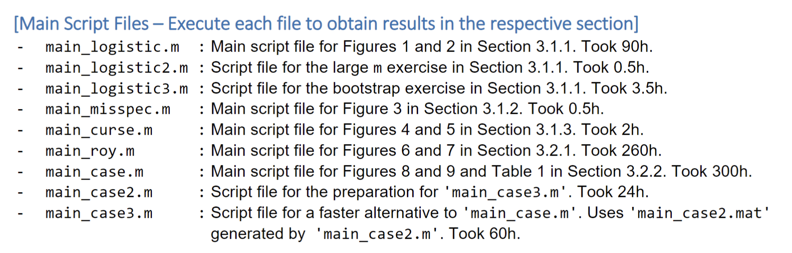

# Adversarial approach to structural estimation

**Kaji, Manresa, Pouliot, 2023**

Presented by Zixuan & Huixin

Date: Jan 24, 2025

*Remark: GANs is a well-studied machine learning technique.*

---

# Data generating 
Goodfellow et al. (2014) proposed an algorithm to generate data $(x_g)$ that mimics the true data $(x_r)$.  
It consists of two *players*:
- **Generator** $G$ that generates data $x_g\sim p_g$ given input $z\sim p_z$. It can be a function $G(z; \theta)$ parametrized by $\theta$.
- **Discriminator** $D$ that distinguishes between real data $x_r$ and generated data $x_g$. It is a classifier $D(x; \lambda) \in [0,1]$ parametrized by $\lambda$.
----
# Two player game

The two *players* play against each other in the following sense. 
$$
\min_G \max_D L(D, G) 
= \mathbb{E}_{x \sim p_{r}(x)} [\log D(x)] + \mathbb{E}_{x \sim p_g(x)} [\log(1 - D(x))]
$$
----
## Discriminator
Let's fix $G$ first.   
Given a $\lambda$, $D(x;\lambda)$ gives the probability that $x$ is real.

Notice that $L(D,G)$ is between 
- $-\log 2$: when $D(x) = 0.5$ for all $x$.
- $0$: when $D(x) = 1$ for real data and $D(x) = 0$ for generated data.
  

----
## Generator
Now, fix $D$. 
Given a parameter $\theta$, $G(z;\theta)$ generates data that follows $p_g$.

Notice that finding the optimal $G$ is equivalent to finding the optimal $\theta$ such that the generated data mimics the real data ($p_g$ resembles $p_r$).

**The generator is essentially estimating the true parameter $\theta_0$ of the DGP.**

----
# Algorithm 

- Initialize $\theta^0$ and $\lambda^0$.
- While $\theta^k$ has not converged: 
  1. Generate $x_g$ from $G(z;\theta^k)$.
  2. Train $D(x;\lambda)$ till convergence with $\{x_r\}$ and $\{x^k_g\}$. Update $\lambda^{k+1}$.
  3. Compute the $L(D_{\lambda^{k+1}},G_{\theta^k})$.
  4. Minimize $L(D_{\lambda^{k+1}},G_{\theta^k})$ with respect to $\theta$. Update $\theta^{k+1}$.

The two *players* play back and forth. When one improves, the other catches up.

----

----
# Remarks

- **What is the main focus?** 
The **structural parameters** $\theta$. The discriminator $D(x;\lambda)$ is like a propeller that pushes the generator $G(z;\theta)$ to find the optimal $\theta$. Itself is not of interests. (The $\lambda$ can be regarded as a nuisance parameter.)
- **What is the property of this generator estimator $\hat{\theta}$?**
  **Consistency and efficiency** both depend on the choice of $D$. 
- **How to train $D$ and $G$?**
$D$ is trained using Neural Networks, while $G$ is not. While in the original GAN, both are trained with NNs.

----

# Competing methods

> The adversarial estimator fills the gap between SMM and MLE.

----
# MLE

$$\min_\theta L_\theta =  -\frac{1}{2n} \sum_{i=1}^n \log p(x_i;\theta)$$

# AdE

$$ \min_\theta M_\theta(D) = \frac{1}{n} \sum_{i=1}^n \log D(x_i) + \frac{1}{m} \sum_{i=1}^m \log (1-D(G_{\theta}(Z_i)))$$

---- 
# SMM
Given
$$\mathbb{E}_{X}(f(X|\theta)) = \theta$$
where $f(X|\theta)$ is some moment condition.
We replace this $\theta$ with a generator $G$ such that
$$\mathbb{E}_{Z}(G(Z|\theta)) = \theta $$
Therefore, the theoretical moment condition we will be using is the following
$$ \mathbb{E}_{X}(f(X|\theta)-\mathbb{E}_{Z}(G(Z|\theta))) = 0$$
----
# SMM

We minimize
$$ \min_\theta S_\theta = \left\{\frac{1}{n}\sum_i^n \left\{f(X_i)-\frac{1}{m} \sum_{j=1}^m G(Z_j|\theta)\right\} \right\}^\top \Omega \left\{\frac{1}{n} \sum_i^n \left\{f(X_i)-\frac{1}{m} \sum_{j=1}^m G(Z_j|\theta)\right\} \right\}$$
where real data has size $n$ and generated data has size $m$.

----
<!-- We assume that 
$$p_r(x) = \Lambda(x) (1-\Lambda(x))$$ -->
# Likelihood: $\mathbb{R}$
In MLE, 
$$p(x)=\Lambda(x-\theta) (1-\Lambda(x-\theta))$$
In AdE,
$$D(x;\lambda_0,\lambda_1)$$

---- 
# Moments: $\mathbb{R}^d$

In SMM, 
$$\mathbb{E}_{X}(f(X|\theta)) = \theta \quad f(X|\theta)\in \mathbb{R}^d$$

In AdE,
$$D(x,x^2,\ldots,x^d;\lambda_0,\ldots,\lambda_d)$$

----
# Moments: $\mathbb{R}^d$

----

# Asymptotic properties 

----
## Consistency

The adversarial estimator is consistent if the estimated loss $\mathbb{M}_\theta(\hat{D}_\theta)$ converges uniformly to the oracle loss $\mathbb{M}_\theta({D}_\theta)$ and $\hat{\theta}$ finds a global minimizer.

**The next 3 statistical properties are derived under parametric specification of the generator $G(z;\theta)$.**
--

## Rate of convergence
$$h(\hat{\theta}, \theta_0) = O^*_P(n^{-1/2})$$

---

## Asymptotic distribution
$$
\sqrt{n}(\hat{\theta} - \theta_0) = 2 \tilde{I}_{\theta_0}^{-1} \sqrt{n} \left[ P_0(1 - D_{\theta_0}) \dot{\ell}_{\theta_0} 
- P_0 D_{\theta_0} \dot{\ell}_{\theta_0} - \tilde{P}_0 \tau_n \right] + o_P^*(1) \rightsquigarrow N(0, \tilde{I}_{\theta_0}^{-1} V \tilde{I}_{\theta_0}^{-1}),
$$

where $V := \lim_{n \to \infty} 4 P_0 D_{\theta_0} (1 - D_{\theta_0}) \dot{\ell}_{\theta_0} \dot{\ell}_{\theta_0}^\top$.

## Efficiency
If the model is correctly specified, the AdE is efficient.
$$\sqrt{n}(\hat{\theta} - \theta_0) = I_{\theta_0}^{-1} \sqrt{n}(P_0 - P_{\theta_0}) \dot{\ell}_{\theta_0} + o_P^*(1) \rightsquigarrow N(0, I_{\theta_0}^{-1}).$$

----

# GANs in Economics

In the paper by Athey et al. (2021),  
> Using Wasserstein Generative Adversarial Networks for the design of Monte Carlo simulations

Why $G$ is also trained using NNs? 

This is because the objective is to **simulate data** that resembles the real data from a field experiment (LaLonde, 1986).

The focus is **not structural estimation** with interpretable parameters. But to **evaluate different estimators** of average treatment effect by **lots of replications.**

---
## Simulation 

For example, we want to evaluate three estimators,

$$\hat{\tau}^\text{cm},\hat{\tau}^\text{ht}, \hat{\tau}^\text{dr}$$

Given **one true data set** (field experiment), we can have

| Experimental       | estimate | s.e. |
| ------------------ | -------- | ---- |
| **$\hat{\tau}^1$** | 1.79     | 0.63 |
| **$\hat{\tau}^2$** | 2.12     | 0.88 |
| **$\hat{\tau}^3$** | 1.79     | 0.57 |

----

##  Compare Estimators

They simulate 2000 replications (each with 1 million units) and compute the **RMSE, Bias, SDev, and Coverage** of the 95% confidence interval.

| Method             | RMSE | Bias  | SDev | Coverage |
| ------------------ | ---- | ----- | ---- | -------- |
| **$\hat{\tau}^1$** | 0.49 | 0.06  | 0.48 | 0.94     |
| **$\hat{\tau}^2$** | 0.58 | 0.00  | 0.58 | 0.96     |
| **$\hat{\tau}^3$** | 0.52 | -0.06 | 0.51 | 0.88     |

----
# Wasserstein Distance

The Wasserstein distance is a measure of the distance between two probability distributions over a metric space.

----
## GANs in Finance

Paper by Xu et al. 
> Using generative adversarial networks to synthesize artificial financial datasets

This paper evaluate the performance of GANs as a means to generate synthetic financial data.

To preserve the unique properties of financial data while maintaining customers’ privacy, generating synthetic or artificial data can be a good way to address this problem.

----

The authors applied the following criteria to evaluate the generator:

1. Distributions of individual features in generated data match those in real data 

2. Overall distributions of generated and real data match each other 

3. Relationship between features and the target variable in real data is replicated in generated data
 
----

Looking at the histogram (Figure 4 in the paper), GANs were able to reproduce discrete distributions just as good as continues ones, and that for some continuous variables GANs tended to produce slightly smoothed versions of their distributions.

----

To test relationship between features and target variable in real and generated data, the authors compared two supervised ML models: 
- one trained on real data,
- another one trained on data produced by GAN. 
  

<!-- AUC scores (in Table 2) were calculated for ground truth target values and predictions obtained from the models trained on real and generated datasets. These scores to be close enough to assume that our GAN model replicated the relationship between the target variables and the features with good accuracy. -->

<!-- Overall, the authors conclude that GANs can learn and accurately reproduce intricate features distribution and relationships between features of real modeling data. -->

----

# Coding

My goal is to replicate in `Python`.

- Well developed libraries: `PyTorch`.
- Parrallel.
- GPU.

----

# Thanks! :satisfied:

 

<!--  -->

<!--  -->

<!-- ----
- Perfect $D$: $D(x) = 1$ if $x$ is real, $D(x) = 0$ if $x$ is fake.
- Oracle $D$: $D(x) = \frac{p_r(x)}{p_r(x) + p_g(x)}$.
- Correctly specified $D$
- Neural network $D$  -->

<!-- > Suppose that for every open $G \subseteq \Theta$ containing $\theta_0$, we have $\inf_{\theta \not\in G} M_\theta(D_\theta) > M_{\theta_0}(D_{\theta_0})$, that $\{ \log D_\theta : \theta \in \Theta \}$ and $\{ \log(1 - D_\theta) \circ T_\theta : \theta \in \Theta \}$ are $P_0$- and $P_Z$-Glivenko–Cantelli, respectively, that $\sup_{\theta \in \Theta} |M_\theta(\hat{D}_\theta) - M_\theta(D_\theta)| \to 0$ in probability, and that $\hat{\theta}$ satisfies $M_{\hat{\theta}}(\hat{D}_{\hat{\theta}}) \leq \inf_{\theta \in \Theta} M_\theta(\hat{D}_\theta) + o_P(1).$ Then $h(\hat{\theta}, \theta_0) \to 0$ in probability. -->

  

| <!--  | symbol         | meaning | distribution |
| ----- | -------------- | ------- |
| $x_r$ | real data      | $p_r$   |
| $x_g$ | generated data | $p_g$   | -->          |

